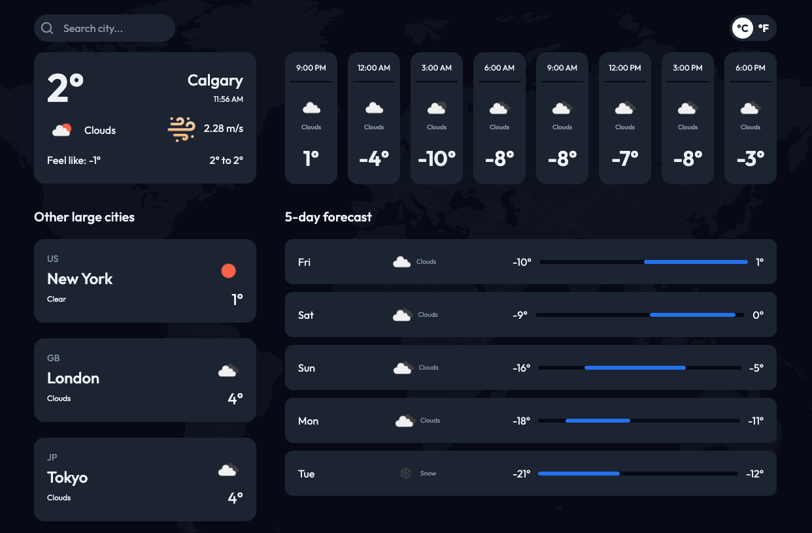

# Weather App

A modern, responsive weather application that provides detailed weather information and forecasts for different locations.

## Features

- **Current Weather Display**: Shows real-time weather information for the user's current location
- **5-Day Weather Forecast**: Displays detailed weather predictions for the next 5 days
- **Temperature Unit Toggle**: Switch between Celsius and Fahrenheit
- **Today's Forecast**: Hourly weather information for the current day
- **Other Cities Weather**: Compare weather conditions across different cities
- **Dynamic Temperature Visualization**: Interactive temperature range bars showing min/max temperatures
- **Responsive Design**: Fully responsive layout that works on desktop and mobile devices

## Technologies Used

### Frontend
- React
- TypeScript
- Tailwind CSS
- date-fns (for date formatting)

### Context Management
- React Context API for global state management

### Styling
- Tailwind CSS for responsive and utility-first styling

### Weather Data
- OpenWeather API (or specify the weather API you're using)

